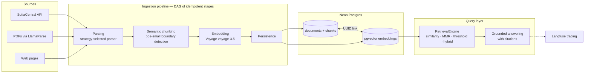

# Meditation Philosophy Database

[](https://github.com/HimanshuBhardwaj2398/meditation-assistant/actions/workflows/quality.yml)

A RAG knowledge base over the Pali Canon. Ingests Buddhist scripture from
SuttaCentral's API (plus PDFs and web pages), chunks it along semantic
boundaries, embeds it into PostgreSQL + pgvector, and serves grounded,
citation-backed answers through retrieval strategies that are **benchmarked,
not guessed** — an LLM-as-judge evaluation harness compares four strategies
against the corpus before any of them reaches the query path.


## Architecture



## Engineering highlights

- **Retrieval evaluation, not vibes** — four strategies (top-k similarity, MMR,
  score threshold, hybrid Postgres full-text + dense) benchmarked with
  LLM-as-judge scoring before choosing what powers the query path.
  → [evaluation design](docs/plans/2026-07-13-retrieval-eval-strategy-design.md) ·
  [retrieval/](retrieval/)
- **Grounded answers with provenance** — every answer cites chunk → document →
  sutta, with prompt and latency traces attached.
  → [retrieval/answering.py](retrieval/answering.py)
- **SuttaCentral segmented-text parser** — SuttaCentral is an SPA, so generic
  scrapers see an empty shell. This parser reconstructs the site's HTML from
  bilara translation layers via the public API; a catalog crawler enumerates
  entire Nikāyas and a batch CLI ingests them with duplicate skipping.
  → [design doc](docs/plans/2026-07-10-suttacentral-ingestion-design.md) ·
  [ingestion/suttacentral.py](ingestion/suttacentral.py)
- **DAG ingestion pipeline** — four idempotent stages (parse → chunk → embed →
  persist) with dependency resolution; failed ingestions resume from where
  they stopped. → [ingestion/stages.py](ingestion/stages.py)
- **Dual-store integrity** — relational metadata and vector rows linked by
  UUID, with integrity enforced by tests, a validation UI page, and CLI
  verification scripts. → [db/schema.py](db/schema.py)
- **Multi-provider LLM client** — one interface over Groq, Ollama (local),
  and OpenAI via litellm; swap providers with an env var.
  → [retrieval/llm_client.py](retrieval/llm_client.py)
- **Design-docs-first process** — features are designed in written docs before
  implementation; the repo keeps them public.
  → [docs index](docs/README.md)

## Quickstart

**Prerequisites**: Python 3.11–3.12, Poetry, PostgreSQL with pgvector
(local Docker or [Neon](https://neon.tech)).

```bash
poetry install
cp .env.example .env        # fill in DB_URL, VOYAGE_API_KEY, LLAMAPARSE_API
poetry run alembic upgrade head
```

**Web UI** — ingest, monitor, browse, validate:

```bash
poetry run streamlit run app.py
```

**CLI**:

```bash
# Ingest one sutta from SuttaCentral (targets NEON_DIRECT_URL from .env)
poetry run python scripts/ingest_one.py sc:mn10/sujato

# Enumerate whole Nikāyas into data/suttacentral_catalog.jsonl
poetry run python scripts/build_catalog.py dn mn

# Batch-ingest suttas (skips already-ingested duplicates)
poetry run python scripts/ingest_batch.py sc:mn1/sujato sc:mn2/sujato

# Ingest a PDF or URL
poetry run python scripts/ingest.py "Books/sutra.pdf" --title "Diamond Sutra"
```

**Query** (Python API):

```python
from retrieval.query import RetrievalEngine, RetrievalStrategy

engine = RetrievalEngine()
results = engine.search("what is mindfulness?", strategy=RetrievalStrategy.HYBRID, k=5)
```

## Corpus

Pali Canon translations by Bhikkhu Sujato (Creative Commons), ingested from
SuttaCentral: Dīgha, Majjhima, Saṃyutta, and Aṅguttara Nikāyas. The pipeline
also accepts arbitrary PDFs and web pages for other contemplative literature.

## Documentation

| Doc | What it covers |
|-----|----------------|
| [Architecture](docs/ARCHITECTURE.md) | System design, module map, design decisions |
| [Docs index](docs/README.md) | Guides, design docs, engineering journal |
| [UI guide](docs/UI_GUIDE.md) | Streamlit interface walkthrough |
| [Changelog](docs/CHANGELOG.md) | Release history |
| [Roadmap](docs/ROADMAP.md) | What's next |

## Development

```bash
poetry run pre-commit install     # one-time: lint/format hooks
poetry run pytest --cov           # 18 test modules
poetry run ruff check . && poetry run mypy .
poetry run python scripts/check_doc_links.py   # docs link integrity
```

CI runs lint, format, mypy, and the test suite on every push and PR to `main`.

## Roadmap

- **Phase 1 — done**: ingestion pipeline, semantic chunking, vector storage, Streamlit UI
- **Phase 2 — in progress**: retrieval-strategy evaluation, grounded query layer with citations
- **Phase 3 — planned**: journaling integration, practice guidance, path exploration

## License

Personal and educational use. Pali Canon translations by Bhikkhu Sujato,
available under Creative Commons.
