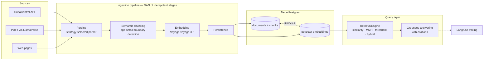

# Architecture

How the system works and why it is built this way. The [README](../README.md)
is the summary; this document is for readers who want to see the actual seams.
Code links point at the symbols they describe.

## System overview

A document enters as a SuttaCentral reference, a PDF, or a URL. A DAG of four
idempotent pipeline stages parses it to markdown, chunks it along semantic
boundaries, embeds the chunks with Voyage `voyage-3.5`, and persists chunk
metadata. Everything lands in a single Postgres database (Neon) that holds both
the relational tables and the pgvector embeddings, linked row-for-row by UUID.
The query layer retrieves with one of four strategies (hybrid dense + full-text
is the default) and synthesizes grounded, citation-backed answers, with optional
Langfuse tracing over both steps.

## Module map

| Module | Responsibility | Key entry points |
|--------|----------------|------------------|
| [`ingestion/`](../ingestion/) | Source → embedded chunks | [`parsing.py`](../ingestion/parsing.py): `URLParser`, `PDFParser`, `ParserFactory` (strategy pattern + factory) · [`suttacentral.py`](../ingestion/suttacentral.py): `SuttaCentralParser`, `SuttaCentralCatalog` · [`chunking.py`](../ingestion/chunking.py): `MarkdownChunker` · [`markdown_utils.py`](../ingestion/markdown_utils.py): shared markdown helpers · [`embed.py`](../ingestion/embed.py): `VectorStoreManager` · [`stages.py`](../ingestion/stages.py): the four pipeline stages · [`orchestrator.py`](../ingestion/orchestrator.py): `PipelineOrchestrator`, `IngestionOrchestrator` |
| [`retrieval/`](../retrieval/) | Search + grounded answering | [`query.py`](../retrieval/query.py): `RetrievalEngine`, `SearchResult` · [`answering.py`](../retrieval/answering.py): `GroundedAnswerService` · [`llm_client.py`](../retrieval/llm_client.py): `LLMClient` · [`utils.py`](../retrieval/utils.py): `extract_header_paths` · three eval notebooks ([dataset generation](../retrieval/eval_dataset_generation.ipynb), [retrieval eval](../retrieval/rag_retrieval_eval.ipynb), [metrics](../retrieval/retrieval_eval_metrics.ipynb)) |
| [`db/`](../db/) | Persistence | [`schema.py`](../db/schema.py): `Document`, `Chunk`, `DocumentStatus` · [`database.py`](../db/database.py): injectable `Database`, `session_scope` · [`crud.py`](../db/crud.py): `DocumentCRUD`, `ChunkCRUD` |
| [`services/`](../services/) | Business logic decoupled from the UI | [`ingestion_service.py`](../services/ingestion_service.py): `ingest_document`, `process_document_by_id` · [`collection_service.py`](../services/collection_service.py): `CollectionService` (atomic cross-store deletes/reprocessing) |
| [`views/`](../views/) | Streamlit pages, wired by [`app.py`](../app.py) | `ingest`, `queue`, `browse`, `document_detail`, `stats`, `validation`, `rag_playground` |
| [`observability/`](../observability/) | Optional tracing | [`langfuse.py`](../observability/langfuse.py): `LangfuseTracer`, `get_langfuse_tracer` — no-ops unless keys are configured |
| [`core/`](../core/) | Contracts shared by all layers | [`interfaces.py`](../core/interfaces.py): `Parser` protocol, `PipelineStage` ABC, frozen `PipelineContext` · [`exceptions.py`](../core/exceptions.py): `MeditationDBError` hierarchy |
| [`config/`](../config/) | Pydantic Settings | [`settings.py`](../config/settings.py): nested `Settings` (database, embedding, parsing, chunking, langfuse, vector). The designated config boundary (design doc [D4](plans/2026-07-10-architecture-hardening-retrieval-foundations-design.md)): ingestion-side env fallbacks route through settings, pinned by [`tests/test_config_boundary.py`](../tests/test_config_boundary.py); a few direct `os.getenv` reads remain in [`retrieval/`](../retrieval/) and [`collection_service.py`](../services/collection_service.py) |
| [`scripts/`](../scripts/) | Operational CLIs | [`ingest_one.py`](../scripts/ingest_one.py), [`ingest_batch.py`](../scripts/ingest_batch.py), [`build_catalog.py`](../scripts/build_catalog.py), [`ingest.py`](../scripts/ingest.py), [`rebuild_toc.py`](../scripts/rebuild_toc.py), [`validate_chunk_toc_integrity.py`](../scripts/validate_chunk_toc_integrity.py), [`verify_database.py`](../scripts/verify_database.py), [`check_doc_links.py`](../scripts/check_doc_links.py) |
| [`alembic/`](../alembic/) | Schema migrations | `alembic upgrade head` creates the initial documents/chunks schema |

## Ingestion pipeline

Four stages, each a [`PipelineStage`](../core/interfaces.py) declaring its
dependencies, defined in [`ingestion/stages.py`](../ingestion/stages.py):

1. **`ParsingStage`** (no dependencies) — [`ParserFactory`](../ingestion/parsing.py)
   picks the first parser whose `can_parse(source)` matches (SuttaCentral refs,
   PDFs via LlamaParse, generic URLs). The parsed markdown, title, and source
   tags are written to the document row immediately, so a later failure never
   loses the parse.
2. **`ChunkingStage`** (requires parsing) — [`MarkdownChunker`](../ingestion/chunking.py)
   splits by headers, subdivides oversized sections at semantic boundaries,
   then merges undersized fragments (details under
   [design decisions](#chunk-sizing-headers-first-semantic-boundaries-where-headers-run-out)).
3. **`EmbeddingStage`** (requires chunking) — assigns each chunk a UUID (also
   used as the PGVector row ID), tags it with `document_id` and source/nikāya
   metadata, and batch-embeds via [`VectorStoreManager`](../ingestion/embed.py).
   It then verifies the vector store returned exactly the assigned UUIDs — any
   count or set mismatch fails the stage rather than silently desyncing the
   two stores.
4. **`DatabasePersistenceStage`** (requires embedding) — inside one
   `session_scope`, writes the chunk rows, builds a table of contents from the
   chunks' header paths into `doc_metadata`, marks the document `COMPLETED`,
   and clears the temporary chunk staging column.

**Orchestration.** [`PipelineOrchestrator`](../ingestion/orchestrator.py)
validates at construction that the stage graph has no cycles (DFS with a
recursion stack), then computes execution order with a topological sort. At
run time it skips stages already `COMPLETED` in the context, refuses stages
whose dependencies didn't complete, and keeps going after a failure so
independent work still runs; failures are recorded per-stage in the context
and the document is marked `FAILED`.

**Idempotency and resume.** The frozen
[`PipelineContext`](../core/interfaces.py) carries `stage_results`, so re-runs
skip finished work. `IngestionOrchestrator.process()` accepts a document ID to
resume a stuck document, and a `ReprocessMode` (`FULL`, `FROM_CHUNKING`,
`FROM_EMBEDDING`) that seeds completed stages from stored markdown or chunk
rows — after first deleting the stale embeddings (by UUID) and chunk rows so
reprocessing can't leave orphans.

**Status flow.** `DocumentStatus` in [`db/schema.py`](../db/schema.py):
`PENDING → PARSING → PARSED → CHUNKING → CHUNKED → EMBEDDING → COMPLETED`,
with `FAILED` on any stage failure. There is deliberately no "persisting"
state — the persistence stage reports under `EMBEDDING` until it flips the
document to `COMPLETED`.

## Query path

[`RetrievalEngine`](../retrieval/query.py) exposes one `search()` over four
`RetrievalStrategy` values:

| Strategy | What it does | When it's the right choice |
|----------|--------------|---------------------------|
| `SIMILARITY` | Top-k pgvector search with raw scores | Baseline and debugging — the only strategy that returns raw similarity scores |
| `MMR` | Re-ranks a `fetch_k=20` candidate pool for diversity | When formulaic repetition (endemic in the suttas) makes top-k results near-duplicates |
| `THRESHOLD` | Similarity filtered by `score_threshold` (default 0.5) | Precision over recall — return nothing rather than weak matches |
| `HYBRID` (default) | Dense retrieval + Postgres full-text search, fused with weighted Reciprocal Rank Fusion (semantic 0.6, FTS 0.4, `rrf_k=60`) | Queries mixing exact terminology (Pali terms, sutta names) with paraphrase |

The sparse side of hybrid is PostgreSQL `to_tsvector` / `plainto_tsquery` /
`ts_rank` executed in SQL. Fusion is rank-only: each list contributes just its
ordering to the weighted RRF sum, with dedup by chunk UUID (SHA-256 content
hash as fallback); min-max-normalized FTS scores are kept in result metadata
only.

Every result is a `SearchResult` carrying provenance: `chunk_uuid` (the
cross-store key), `document_id`, `source_title`, `chunk_index`, full chunk
`metadata`, `rank`, and `score`. A post-search enrichment joins
`chunks → documents` to fill in titles. The `SearchResponse` also carries a
`SearchTrace` — collection, embedding model, parameters, latency, whether FTS
ran, Langfuse trace ID/URL, and human-readable notes on the strategy used.

[`GroundedAnswerService`](../retrieval/answering.py) synthesizes an answer
from the top 4 chunks (each capped at 1,200 chars), formatted as numbered
context blocks with source title, chunk index, and header path. The system
prompt requires inline `[n]` citations and instructs the model to say so when
the retrieved evidence is insufficient; generation runs at temperature 0.1.
The `AnswerResponse` returns one `AnswerCitation` per context chunk (label,
source title, document ID, chunk index, chunk UUID, header path, excerpt) and
an `AnswerTrace` with the exact prompts, context size, model ID, and latency.

[`LLMClient`](../retrieval/llm_client.py) is one litellm-backed interface over
three providers, selected by `LLM_PROVIDER`: `groq` (default,
`llama-3.3-70b-versatile`), `ollama` (local, `qwen2.5:7b`), and `openai`
(`gpt-4o-mini`); `LLM_MODEL` overrides the per-provider default.

Tracing is optional: [`LangfuseTracer`](../observability/langfuse.py) no-ops
unless public and secret keys are configured. When active, it records two
spans — `retrieval.search` (query, strategy, parameters, collection → top
results) and `retrieval.answer` (query, model, source chunks → answer text,
model parameters) — and hands the trace ID/URL back into `SearchTrace` and
`AnswerTrace` so the UI can link straight to the trace.

## Data model

Two owned tables in [`db/schema.py`](../db/schema.py), plus the
LangChain-managed vector table:

- **`documents`** — `id`, `title`, `file_path`, `description`, `markdown`
  (the parsed text, kept for reprocessing), `doc_metadata` (JSONB — includes
  the generated `table_of_contents`), `tags` (text array), `status` (enum,
  indexed), `status_details`, `chunks` (JSONB staging, cleared on completion),
  `created_at`, `updated_at`.
- **`chunks`** — `id`, `uuid` (unique — the cross-store key), `document_id`
  (FK with `ON DELETE CASCADE`), `chunk_text`, `chunk_index`,
  `chunk_metadata` (JSONB: header paths, semantic-boundary info, source and
  nikāya tags), `created_at`.
- **`langchain_pg_embedding`** — owned by LangChain's PGVector.
  `EmbeddingStage` sets each LangChain `Document.id` to the chunk's UUID, so
  the embedding row ID equals `chunks.uuid` exactly.

Embeddings are partitioned into PGVector **collections** by source type. The
default is `buddhist_texts` ([`VectorSettings.collection_name`](../config/settings.py),
`VECTOR_COLLECTION_NAME` env var); ingestion CLIs and services accept a
collection argument to route a source elsewhere (e.g. `talks`).

## Design decisions

### Dual storage linked by UUID, not one table

LangChain's PGVector owns its tables and treats their schema as private.
Instead of forcing application metadata into that table, the relational side
(`documents`/`chunks`) stays fully owned — foreign keys, cascades, status
tracking, JSONB metadata, migrations — and joins to the vector side by UUID.
The vector layer stays swappable (the community `PGVector` class is already
deprecated upstream) without touching application data. The cost is a
cross-store consistency obligation, paid deliberately: `EmbeddingStage`'s ID
verification, the validation UI page, and
[`scripts/verify_database.py`](../scripts/verify_database.py).

### Callers own transactions

CRUD methods `flush()` — so IDs materialize and constraint errors surface
early — but never `commit()`; the enclosing `session_scope()` is the unit of
work. This made `DatabasePersistenceStage`'s four writes (chunks, TOC, status,
staging cleanup) actually atomic, where interior commits had previously made
partial persistence durable. Enforced by contract tests
([`tests/test_crud_transaction_ownership.py`](../tests/test_crud_transaction_ownership.py));
decided in the [architecture hardening design](plans/2026-07-10-architecture-hardening-retrieval-foundations-design.md)
and landed in commit `f42d6c8`.

### Parser strategy pattern — and why SuttaCentral needed its own parser

`ParserFactory` selects the first `Parser` (a structural protocol) whose
`can_parse(source)` accepts the input, so new source types are added without
touching the pipeline. SuttaCentral forced the pattern to earn its keep: the
site is an SPA, so `URLParser`'s plain `requests.get` sees only the empty
shell. [`SuttaCentralParser`](../ingestion/suttacentral.py) instead calls the
public API and, for segmented (bilara) translations like Bhikkhu Sujato's,
reconstructs the site's own HTML by filling each `html_text` segment template
with the `translation_text` layer (`bilara_to_html`) — which then converts to
the clean header-delimited markdown the chunker expects. A companion
`SuttaCentralCatalog` crawls whole Nikāyas into a JSONL catalog for batch
ingestion. Details in the [SuttaCentral ingestion design](plans/2026-07-10-suttacentral-ingestion-design.md).

### Chunk sizing: headers first, semantic boundaries where headers run out

Defaults are min 700 / max 2,000 characters, set by the `CHUNKING_*` settings
and delivered to the chunker via `Config.from_settings()` in
[`ingestion/chunking.py`](../ingestion/chunking.py) — the orchestrator's
default configuration. Header splitting tracks sutta structure, but a sutta
routinely puts thousands of words of repetitive prose under a single heading,
so header-only splitting leaves chunks far past any useful embedding size.
Oversized sections are therefore subdivided by a `SemanticChunker` using
`BAAI/bge-small-en-v1.5` embeddings to find topic-shift boundaries, and
sub-minimum fragments are merged into neighbors so the canon's formulaic
refrains don't become noise chunks.

### Injectable `Database` — no import-time engine

The SQLAlchemy engine and session factory live on a
[`Database`](../db/database.py) object built lazily from `DatabaseSettings`;
importing `db.database` requires no configuration and builds nothing (commit
`1b8e1c4`). `set_default_database()` lets a composition root redirect the
module-level `session_scope` — exactly how the SuttaCentral CLIs point the
entire pipeline at `NEON_DIRECT_URL` — and tests inject an in-memory SQLite
`Database` without environment hacks.

### Hybrid retrieval: Postgres FTS + dense, replacing in-memory BM25

The first hybrid implementation used `BM25Retriever.from_documents()`, which
loads every chunk into RAM to build its index on first search — fine at
hundreds of chunks, wrong at the 100k-chunk scale this corpus is headed for.
The [query-layer design](plans/2026-03-22-query-layer-instagram-pipeline-design.md)
replaced it with Postgres full-text search executed in SQL (the
`_bm25_search` method keeps its historical name; its docstring says what it
does now). The sparse side now scales with the database, needs no warmup, and
reads the same store of record as everything else.

## Testing & CI

Twenty-three tracked test modules under [`tests/`](../tests/); external services
(Voyage, LlamaParse, LLM providers, Langfuse) are faked. The integrity-focused
ones and what they actually guarantee:

- [`test_embedding_integrity.py`](../tests/test_embedding_integrity.py) — the
  embedding stage fails loudly if the vector store returns IDs differing from
  the assigned chunk UUIDs, so the UUID link can't silently drift.
- [`test_crud_transaction_ownership.py`](../tests/test_crud_transaction_ownership.py)
  — CRUD methods never commit; multi-step persistence stays atomic.
- [`test_pipeline_context_immutability.py`](../tests/test_pipeline_context_immutability.py)
  — `PipelineContext` rejects mutation and stages copy chunks instead of
  editing shared state.
- [`test_reprocess_modes.py`](../tests/test_reprocess_modes.py) — invalid
  reprocess modes and `clear_markdown` misuse are rejected before any data is
  touched.
- [`test_chunk_toc_validation.py`](../tests/test_chunk_toc_validation.py) —
  the chunk ↔ table-of-contents header-path validators behind the validation
  UI and CLI.
- [`tests/retrieval/`](../tests/retrieval/) — FTS SQL, RRF fusion and dedup,
  trace propagation, grounded answering (via a fake `LLMClient`), provider
  selection.
- [`test_config_boundary.py`](../tests/test_config_boundary.py) and
  [`test_exception_unification.py`](../tests/test_exception_unification.py) —
  env access stays behind `config/` and the exception hierarchy stays single.
- [`tests/ingestion/test_suttacentral.py`](../tests/ingestion/test_suttacentral.py)
  — reference parsing, bilara HTML reconstruction, catalog enumeration.

CI ([`quality.yml`](../.github/workflows/quality.yml)) runs two jobs on every
push and PR to `main`: lint/format (`ruff check`, `ruff format --check`) plus
mypy — currently `continue-on-error: true`, so type errors are visible but not
yet blocking, with a TODO in the workflow to flip it once existing findings
are fixed — and the test suite (`pytest --cov`) with dummy database/API env
vars, since tests mock all external connections.
